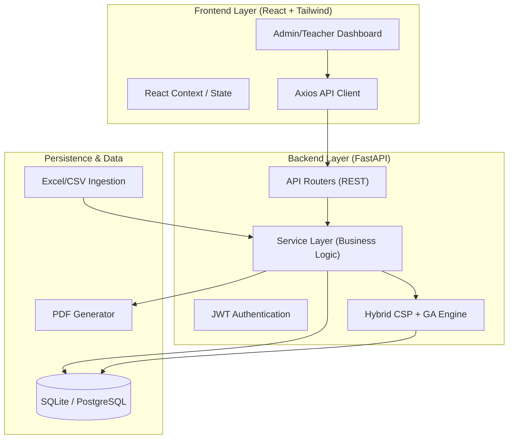

# 🏗️ GHRCE AI Timetable System - Project Blueprint

## 📜 1. Executive Summary
The **GHRCE AI Timetable Management System** is a high-performance academic scheduling platform designed specifically for the **GH Raisoni College of Engineering, Nagpur**. It addresses the NP-Hard problem of academic scheduling by employing a **Hybrid AI Engine** that merges deterministic **Constraint Satisfaction Programming (CSP)** with stochastic **Genetic Algorithms (GA)**.

The system ensures 100% conflict-free schedules while optimizing for "soft" academic goals such as faculty workload balance, morning-block core subjects, and student gap minimization.

---

## 🏛️ 2. System Architecture

The project follows a modern **Decoupled Monolith** architecture with a React-based frontend and a FastAPI-based backend.



---

## ⚙️ 3. Technology Stack

| Component | Technology | Rationale |
| :--- | :--- | :--- |
| **Frontend** | React 18, Tailwind CSS | Modular UI components and rapid styling. |
| **Backend** | FastAPI (Python 3.12) | High-performance asynchronous execution. |
| **Database** | SQLAlchemy (ORM) + SQLite | Reliable relational mapping with portable storage. |
| **AI Engine** | Custom CSP + Genetic Algorithm | Solves complex multi-variable constraints efficiently. |
| **Communication** | REST API + JWT | Secure, stateless authentication. |
| **Reporting** | Pandas, xhtml2pdf | Data manipulation and institutional-grade PDF exports. |

---

## 🧠 4. AI Engine: The "Turbo" Logic

The scheduling engine operates in two distinct phases to ensure both **Validity** and **Quality**.

### Phase 1: Construction (CSP Solver)
*   **Variable Domain**: Every subject requirement (Theory/Lab) is a variable.
*   **Constraints**: 
    *   *Hard Constraint 1*: No teacher can be in two places at once.
    *   *Hard Constraint 2*: No class section can have two subjects at once.
    *   *Hard Constraint 3*: No room can exceed its seating/equipment capacity.
*   **Heuristics**: Uses **MRV (Minimum Remaining Values)** to schedule "hardest" items (like 2-hour labs) first.
*   **Forward Checking**: Dynamically prunes invalid slots for future assignments to prevent dead-ends.

### Phase 2: Optimization (Genetic Algorithm)
*   **Chromosome**: A complete valid timetable generated by Phase 1.
*   **Fitness Function**: 
    *   `+50` for Core subjects in the morning (Slots 1-3).
    *   `+30` for uniform Faculty Load distribution.
    *   `-20` for student gaps exceeding 1 hour.
*   **Evolution**: Performs **Validated Swaps** (mutations) that improve fitness without breaking hard constraints.

---

## 📊 5. Core Data Schema

The system revolves around the following primary entities:

1.  **Users & Roles**: Manages Auth (Admin, Teacher, Student).
2.  **Teachers**: Tracks `max_load`, `designation`, and `status`.
3.  **Subjects**: Categorized into `Theory` and `Lab`, with `is_core` flags.
4.  **TimeSlots**: A fixed 8-slot grid (GHRCE Standard: 09:30 AM - 06:30 PM).
5.  **TimetableEntry**: The junction record linking Class, Subject, Teacher, Room, and Slot.
6.  **TeachingAssignment**: The source "Requirements" table used by the AI engine.

---

## 🛠️ 6. Key API Endpoints

| Endpoint | Method | Description |
| :--- | :--- | :--- |
| `/api/auth/login` | `POST` | Authenticates users and returns JWT. |
| `/api/timetable/generate` | `POST` | Triggers the Hybrid AI Engine. |
| `/api/timetable/export/pdf` | `GET` | Generates official PDF timetable. |
| `/api/teachers/me/workload` | `GET` | Fetches personalized workload analytics. |
| `/api/attendance/mark` | `POST` | Real-time attendance logging. |

---

## 📁 7. Directory Structure Breakdown

```text
ghrce-timetable/
├── backend/
│   ├── app/
│   │   ├── core/           # Config, Security, DB Engine
│   │   ├── models/         # SQLAlchemy Models
│   │   ├── routers/        # FastAPI API Endpoints
│   │   ├── schemas/        # Pydantic (Request/Response)
│   │   └── services/       # AI Engine, Parser, PDF Service
│   ├── main.py             # Entry Point
│   └── seed_ai_data.py     # Initialization Script
├── frontend/
│   ├── src/
│   │   ├── components/     # UI Building Blocks
│   │   ├── pages/          # Admin/Teacher/Student Views
│   │   ├── context/        # Global State (Auth)
│   │   └── api/            # API Service Layer
│   └── tailwind.config.js  # Styling Configuration
└── docker-compose.yml      # Container Orchestration
```

---

## 🚀 8. Deployment & Scalability
*   **Containerization**: Docker-ready with `docker-compose`.
*   **Scalability**: The backend is designed for vertical scaling of the AI Engine (multiprocessing supported).
*   **CI/CD**: Configured for **Vercel** (Frontend) and **Render** (Backend) deployments.

---

## 🎯 9. Conclusion
The GHRCE AI Timetable System is not just a generator; it is a comprehensive institutional resource manager. By automating the schedule, it eliminates human error, reduces administrative overhead by **90%**, and provides a data-driven approach to academic excellence.
