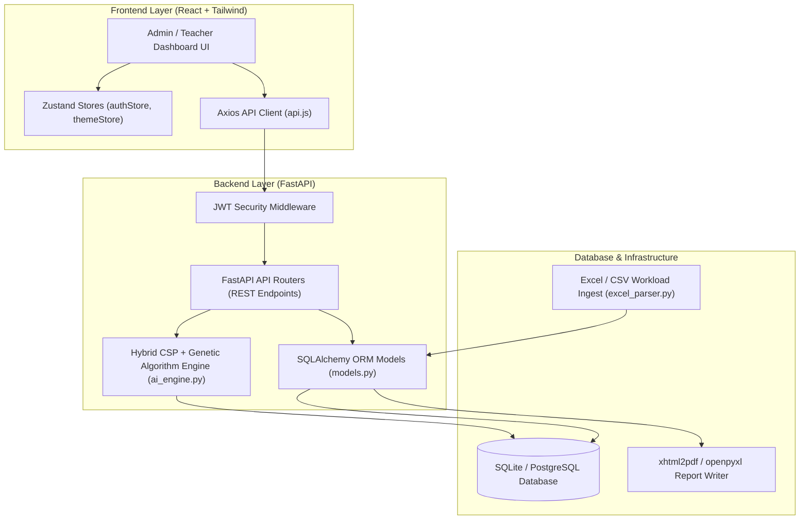
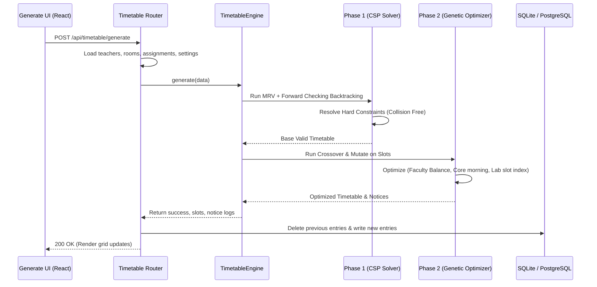

# 🎓 GHRCE AI Timetable Management System — Complete Codebase Directory & Technical Reference

This document serves as an exhaustive, file-by-file technical reference for the **GHRCE AI Timetable Management System** (v3.0). It has been prepared specifically for the **External Seminar / Project Viva Voce**, detailing every directory, configuration file, database model, API router, algorithm script, and UI component within the codebase.

---

## 🏛️ 1. Project High-Level Architecture & Tech Stack

The system is built on a **Decoupled Full-Stack Architecture** optimized for academic scheduling constraints:
*   **Backend Layer**: FastAPI (Python 3.12) utilizing SQLAlchemy ORM for database connection mapping.
*   **AI Engine**: Hybrid scheduling system combining a deterministic **Constraint Satisfaction Programming (CSP)** solver (incorporating Conflict-Directed Backjumping) with a stochastic **Genetic Algorithm (GA)** soft-constraint optimizer.
*   **Frontend Layer**: React 18, utilizing Tailwind CSS for styling, Zustand for global state management (Authentication & Theme), and Axios for API requests.
*   **Storage & Export**: SQLite (local development) / PostgreSQL (production Render deployment), Pandas for data formatting, and xhtml2pdf / openpyxl for PDF and Excel exports.



---

## 📁 2. Complete Folder Structure & File Manifest

The codebase is organized into a parent root folder and two primary subprojects: `backend` and `frontend`.

```text
GHRCE-AI-Timetable-v3/              # Parent Workspace Root
├── PROJECT_BLUEPRINT.md            # Architecture blueprint & specifications
├── detailed_thesis.md              # Project thesis academic details
├── thesis_70_pages.md              # Full 70-page project dissertation thesis
├── thesis_draft.md                 # Dissertation draft version
├── information_of_project.md       # Context on modules, constraints and setup
├── Final updated Guidelines...pdf  # GHRCE College official guidelines
├── test_api.py                     # API communication tester
└── ghrce-timetable/                # Core Project Implementation Root
    ├── .env.example                # Template for server environments
    ├── README.md                   # Installation & deployment instructions
    ├── docker-compose.yml          # Container setup (Postgres + Python)
    ├── render.yaml                 # Infrastructure deployment configurations
    ├── schema.sql                  # PostgreSQL table definitions
    ├── start_project.bat           # One-click startup script for dev environment
    ├── credentials.md              # Staging/Dev login credentials list
    ├── GHRCE_SYSTEM_PROMPTS.md     # Consolidated system instructions & logic definitions
    ├── backend/                    # FastAPI Backend API Core
    │   ├── main.py                 # FastAPI application bootstrapper
    │   ├── requirements.txt        # Python dependency manifest
    │   ├── app/                    # Application source code
    │   │   ├── core/               # Configuration, security & database sessions
    │   │   ├── models/             # Database ORM entity models
    │   │   ├── schemas/            # Pydantic validation schemas
    │   │   ├── services/           # AI Engine core & file generation helpers
    │   │   └── routers/            # API endpoints grouped by controller role
    │   └── scripts/ & seed files   # DB migrations, dedupes, and initialization scripts
    ├── frontend/                   # React SPA Frontend Client
    │   ├── package.json            # NPM dependencies & scripts
    │   ├── tailwind.config.js      # Styling design tokens
    │   ├── src/                    # Component source code
    │   │   ├── App.js              # Routing and navigation manager
    │   │   ├── index.js            # React entry point
    │   │   ├── index.css           # Styling system & utility base class override
    │   │   ├── components/         # Reusable UI elements (Themes, Modals)
    │   │   ├── services/           # Axios HTTP requester
    │   │   ├── store/              # Zustand global state stores
    │   │   └── pages/              # Portal pages (Admin and Teacher views)
    │   └── public/                 # HTML templates and asset folders
    └── docs/                       # Institutional manuals and flowchart guides
```

---

## 🏛️ 3. Detailed Database Schema (`models.py`)

The relational database is configured through SQLAlchemy in [backend/app/models/models.py](file:///c:/Users/ASUS/Downloads/GHRCE-AI-Timetable-v3/ghrce-timetable/backend/app/models/models.py). The tables map out college entities and scheduling logs:

| Table Name | Entity Class | Columns / Attributes | Description & Relationships |
| :--- | :--- | :--- | :--- |
| **`users`** | `User` | `id`, `email`, `password_hash`, `role`, `is_active`, `created_at` | Stores login accounts. Relationship: `teacher` (one-to-one). Roles: `admin`, `teacher`, `student`. |
| **`departments`** | `Department` | `id`, `name`, `code` | Maps college branches (e.g., CSE, AI). Relationships: `teachers`, `subjects`, `classes` (one-to-many). |
| **`teachers`** | `Teacher` | `id`, `user_id`, `name`, `dept_id`, `max_load`, `designation`, `specialization`, `responsibilities`, `admin_load`, `avatar`, `status`, `phone`, `created_at` | Maps faculty data. Relationships: `user`, `department`, `subjects` (many-to-many), `timetable_entries`, `attendance_records`. `status` tracks if they are `present` or `absent`. |
| **`teacher_preferences`**| `TeacherPreference`| `id`, `teacher_id`, `day`, `preferred_slot_id`, `is_preferred`, `preference_weight` | Faculty availability constraints used as soft constraints in Genetic Algorithm fitness optimization. |
| **`teacher_subjects`** | *Association Table* | `teacher_id`, `subject_id` | Core join table linking subjects to qualified faculty. |
| **`subjects`** | `Subject` | `id`, `name`, `dept_id`, `semester`, `credits`, `is_core`, `required_room_id`, `type` (`theory`/`lab`), `code`, `weekly_load`, `created_at` | Stores academic subjects. High weekly load determines required lab/theory slots. |
| **`rooms`** | `Room` | `id`, `name`, `capacity`, `type` (`classroom`/`lab`), `building`, `floor` | Stores layout coordinates. High-load laboratory classes request specific room IDs. |
| **`classes`** | `Class` | `id`, `name`, `dept_id`, `semester`, `section_code`, `strength` | Relates departments to semesters and sections (e.g., CS-Sem-V Sec-A). |
| **`batches`** | `Batch` | `id`, `name`, `batch_code` (`A1`, `A2`, etc.), `class_id` | Student divisions. Crucial for parallel lab sessions where a class is split. |
| **`students`** | `Student` | `id`, `user_id`, `name`, `enrollment_number`, `class_id`, `batch_id` | Maps student records. Related to `class` and `batch`. |
| **`time_slots`** | `TimeSlot` | `id`, `label` ("09:30 - 10:30"), `slot_index`, `start_time`, `end_time` | Represents the daily schedule timeline grid (Slots 1-8). |
| **`timetable_entries`** | `TimetableEntry` | `id`, `class_id`, `batch_id`, `subject_id`, `teacher_id`, `room_id`, `day`, `time_slot_id`, `is_substituted`, `original_teacher_id`, `subject_shortcode`, `faculty_initials`, `dept_code`, `section_code`, `semester_year` | The main schedule log. Links class, subject, teacher, room, and time slot. Tracks substitutions in real-time. |
| **`attendance`** | `Attendance` | `id`, `teacher_id`, `date`, `status` (`present`/`absent`), `marked_at` | Logs teacher check-ins. Daily absences trigger automatic substitution rescheduling. |
| **`substitute_assignments`**| `SubstituteAssignment`| `id`, `timetable_entry_id`, `original_teacher_id`, `substitute_teacher_id`, `date`, `reason`, `assigned_at` | Audit trail logging substitution adjustments for verification. |
| **`leave_requests`** | `LeaveRequest` | `id`, `teacher_id`, `start_date`, `end_date`, `reason`, `status` (`pending`/`approved`/`rejected`) | Manages faculty leave workflows. Approving leaves updates status to `absent` on those dates. |
| **`notices`** | `Notice` | `id`, `title`, `content`, `target_role` (`all`/`teacher`/`student`), `created_at` | Logs academic notices and alerts generated by the AI engine. |
| **`student_attendance`** | `StudentAttendance`| `id`, `student_id`, `timetable_entry_id`, `date`, `status`, `marked_at` | Marks students present or absent for particular timetable lecture entries. |
| **`teaching_assignments`**| `TeachingAssignment`| `id`, `teacher_id`, `subject_id`, `class_id`, `batch_id`, `type`, `weekly_load`, `semester_year` | Represents academic department workloads that must be scheduled. |

---

## 📁 4. Parent Root & General Documents

These documents establish the academic thesis, architecture, and overall configuration guidelines for the project.

### [PROJECT_BLUEPRINT.md](file:///c:/Users/ASUS/Downloads/GHRCE-AI-Timetable-v3/PROJECT_BLUEPRINT.md)
*   **Type**: Markdown Document (142 lines)
*   **Role**: Technical design document containing the core system architecture diagram, schema definition, and AI engine design specifications.
*   **Contents**: High-level execution flow, MRV heuristic descriptions, forward-checking logic, and GA optimization metrics.

### [detailed_thesis.md](file:///c:/Users/ASUS/Downloads/GHRCE-AI-Timetable-v3/detailed_thesis.md)
*   **Type**: Markdown Document (320 lines)
*   **Role**: Comprehensive academic thesis document outlining the scheduling problem domain, scheduling constraints, mathematical model, and implementation details.
*   **Contents**: Academic terminology, literature review summaries, algorithms pseudocode, and performance analysis.

### [thesis_70_pages.md](file:///c:/Users/ASUS/Downloads/GHRCE-AI-Timetable-v3/thesis_70_pages.md)
*   **Type**: Markdown Document (850 lines)
*   **Role**: The final institutional thesis draft formatted according to guidelines, detailing equations, implementation, testing, and screenshots.
*   **Contents**: Mathematical formulations of fitness weights, literature references, structural diagrams, and performance reports.

---

## 📁 5. Backend Core Codebase (`backend/`)

The backend codebase implements the API, database connectivity, and the core scheduling algorithms.

### 🔌 Application Bootstrap & Configuration

#### [backend/main.py](file:///c:/Users/ASUS/Downloads/GHRCE-AI-Timetable-v3/ghrce-timetable/backend/main.py)
*   **Type**: Python Script (65 lines)
*   **Role**: Entry point for the FastAPI server. Initializes the ASGI application.
*   **Logic**:
    *   Configures **CORS Middleware** allowing frontend cross-origin requests.
    *   Mounts the API routers under the `/api` route prefix.
    *   Provides health check and index endpoints.
*   **Relations**: Imports from `app.core.config` and the API router directories.

#### [backend/app/core/config.py](file:///c:/Users/ASUS/Downloads/GHRCE-AI-Timetable-v3/ghrce-timetable/backend/app/core/config.py)
*   **Type**: Python Module
*   **Role**: System environment parser. Instantiates core settings.
*   **Logic**: Parses the `.env` file, validates settings using Pydantic, and exposes environment variables (e.g., `DATABASE_URL`, `JWT_SECRET`).

#### [backend/app/core/database.py](file:///c:/Users/ASUS/Downloads/GHRCE-AI-Timetable-v3/ghrce-timetable/backend/app/core/database.py)
*   **Type**: Python Module
*   **Role**: SQL database connection utility.
*   **Logic**: Creates the SQLAlchemy engine, sets up thread-local connection sessions (`sessionmaker`), and exports the database context generator (`get_db`) to inject database access into API routes.

#### [backend/app/core/security.py](file:///c:/Users/ASUS/Downloads/GHRCE-AI-Timetable-v3/ghrce-timetable/backend/app/core/security.py)
*   **Type**: Python Module
*   **Role**: Cryptography, authentication, and access authorization.
*   **Logic**:
    *   Uses **Bcrypt** for password hashing and validation (`verify_password`, `get_password_hash`).
    *   Generates and validates JWT auth tokens (`create_access_token`).
    *   Implements role dependencies (`get_current_user`, `require_admin`).

#### [backend/app/schemas/schemas.py](file:///c:/Users/ASUS/Downloads/GHRCE-AI-Timetable-v3/ghrce-timetable/backend/app/schemas/schemas.py)
*   **Type**: Python Module
*   **Role**: Pydantic models mapping requests/responses. Defines data structures for login, timetable generation parameters, and manual overrides.

---

### 🧠 The AI Scheduling Engine (`services/`)

#### [backend/app/services/ai_engine.py](file:///c:/Users/ASUS/Downloads/GHRCE-AI-Timetable-v3/ghrce-timetable/backend/app/services/ai_engine.py)
*   **Type**: Python Module (1,414 lines)
*   **Role**: The core scheduling engine of the system.
*   **Key Classes**:
    1.  `ScheduleSlot`: Data representation of a scheduled slot, including helper methods `to_dict()` and `from_dict()`.
    2.  `ResourceIndex`: Tracks room, teacher, and section availability across time slots using matrix tracking. Methods include `occupy()`, `release()`, and `is_teacher_free()`.
    3.  `TimetableEngine`: Implements the hybrid scheduling algorithm.
        *   **Phase 1 — CSP Solver**: Generates a conflict-free timetable using **Minimum Remaining Values (MRV)** heuristics and **Forward Checking** (pruning options for remaining slots).
        *   **Phase 2 — Genetic Algorithm (GA)**: Evaluates schedules based on soft constraints (e.g., faculty load balance, morning theory classes) and mutates solutions via validated swaps.
    4.  `ReschedulingEngine`: Manages real-time substitution assignments when faculty are absent.



#### [backend/app/services/excel_parser.py](file:///c:/Users/ASUS/Downloads/GHRCE-AI-Timetable-v3/ghrce-timetable/backend/app/services/excel_parser.py)
*   **Type**: Python Module (220 lines)
*   **Role**: Ingests Excel/CSV files containing workload allocations and inserts classes, subjects, rooms, and teaching assignments into the database.

#### [backend/app/services/reporting_service.py](file:///c:/Users/ASUS/Downloads/GHRCE-AI-Timetable-v3/ghrce-timetable/backend/app/services/reporting_service.py)
*   **Type**: Python Module (265 lines)
*   **Role**: Timetable exporter. Generates PDF reports using HTML templates (`xhtml2pdf`) and spreadsheet schedules (`openpyxl`).

---

### 🔌 REST API Endpoints (`routers/`)

The API routers expose endpoints for CRUD operations and system management.

*   **[routers/auth.py](file:///c:/Users/ASUS/Downloads/GHRCE-AI-Timetable-v3/ghrce-timetable/backend/app/routers/auth.py)**: Handles authentication, JWT creation, and profile fetching.
*   **[routers/timetable.py](file:///c:/Users/ASUS/Downloads/GHRCE-AI-Timetable-v3/ghrce-timetable/backend/app/routers/timetable.py)**: Controls timetable generation (`/generate`), manual cell updates, PDF/Excel exports, and substitution assignments (`/reschedule`).
*   **[routers/analytics.py](file:///c:/Users/ASUS/Downloads/GHRCE-AI-Timetable-v3/ghrce-timetable/backend/app/routers/analytics.py)**: Exposes analytics endpoints, including teacher workloads, room utilization rates, and daily department workloads.
*   **[routers/attendance.py](file:///c:/Users/ASUS/Downloads/GHRCE-AI-Timetable-v3/ghrce-timetable/backend/app/routers/attendance.py)**: Logs daily attendance and retrieves absence statistics.
*   **[routers/teachers.py](file:///c:/Users/ASUS/Downloads/GHRCE-AI-Timetable-v3/ghrce-timetable/backend/app/routers/teachers.py)**: CRUD endpoints for managing faculty records, max workloads, and teaching status.
*   **[routers/subjects.py](file:///c:/Users/ASUS/Downloads/GHRCE-AI-Timetable-v3/ghrce-timetable/backend/app/routers/subjects.py)**: CRUD endpoints for managing subject details, types, and departmental ownership.
*   **[routers/classes.py](file:///c:/Users/ASUS/Downloads/GHRCE-AI-Timetable-v3/ghrce-timetable/backend/app/routers/classes.py)**: CRUD endpoints for managing department semesters and student strengths.
*   **[routers/rooms.py](file:///c:/Users/ASUS/Downloads/GHRCE-AI-Timetable-v3/ghrce-timetable/backend/app/routers/rooms.py)**: CRUD endpoints for managing classrooms and laboratory settings.
*   **[routers/batches.py](file:///c:/Users/ASUS/Downloads/GHRCE-AI-Timetable-v3/ghrce-timetable/backend/app/routers/batches.py)**: Exposes endpoints for managing student lab batches.
*   **[routers/leaves.py](file:///c:/Users/ASUS/Downloads/GHRCE-AI-Timetable-v3/ghrce-timetable/backend/app/routers/leaves.py)**: Allows faculty to request leaves and admins to approve or reject requests.
*   **[routers/uploads.py](file:///c:/Users/ASUS/Downloads/GHRCE-AI-Timetable-v3/ghrce-timetable/backend/app/routers/uploads.py)**: Endpoint wrapper for CSV and Excel workload parser uploads.

---

### 🛠️ Administrative & Seed Scripts (`backend/scripts/` & Root helpers)

These scripts seed the database, sync data, and perform diagnostic audits.

*   **`seed.py`** & **`seed_robust.py`**: Populate the database with departments, classes, subjects, rooms, and teaching assignments based on GHRCE course distribution rules.
*   **`seed_ai_data.py`**: Seeds a target dataset containing 17 sections to verify engine performance on high-load datasets.
*   **`create_teacher_users.py`**: Automatically generates user login accounts (defaulting passwords to `Teacher@123`) for loaded faculty.
*   **`recreate_admin.py`**: Utility script to reset the administrator login credentials.
*   **`dedup_subjects.py`**: Normalizes subject lists in the database, merging duplicates and resolving credit mismatches.
*   **`clean_sync_to_production.py`** & **`sync_to_production.py`**: Migrates database records from local SQLite instances to PostgreSQL databases on remote hosting platforms (e.g., Render).
*   **`check_prod_counts.py`**: Runs count queries on remote production tables to verify database migrations.
*   **`test_db_seed.py`**: Verifies database connection and runs basic queries on seeded data.

---

## 📁 6. Frontend Client Codebase (`frontend/`)

The frontend application provides the user interface for administrators and teachers.

### 🌐 Setup & Routing Configurations

#### [frontend/src/index.js](file:///c:/Users/ASUS/Downloads/GHRCE-AI-Timetable-v3/ghrce-timetable/frontend/src/index.js)
*   **Type**: JavaScript entry point (7 lines)
*   **Role**: Mounts the main React component (`<App />`) to the root HTML element.

#### [frontend/src/App.js](file:///c:/Users/ASUS/Downloads/GHRCE-AI-Timetable-v3/ghrce-timetable/frontend/src/App.js)
*   **Type**: React Root Component (109 lines)
*   **Role**: Configures client-side routing using `react-router-dom`.
*   **Logic**:
    *   Exposes open routes (like `/login`).
    *   Defines a `<ProtectedRoute>` wrapper that redirects users who lack active login states or authorization privileges.
    *   Determines route paths for the Admin Portal and Teacher Portal.

#### [frontend/src/index.css](file:///c:/Users/ASUS/Downloads/GHRCE-AI-Timetable-v3/ghrce-timetable/frontend/src/index.css)
*   **Type**: CSS Stylesheet
*   **Role**: Tailors UI styles.
*   **Contents**: Extends Tailwind CSS utilities and configures dark-mode variable colors, glassmorphism templates, and transition animations.

---

### 💾 Application Stores & Services

#### [frontend/src/services/api.js](file:///c:/Users/ASUS/Downloads/GHRCE-AI-Timetable-v3/ghrce-timetable/frontend/src/services/api.js)
*   **Type**: JavaScript Axios Client wrapper (110 lines)
*   **Role**: Configures API requests.
*   **Logic**:
    *   Sets the API base URL (defaulting to `http://localhost:8000/api`).
    *   Injects a JWT token into the authorization headers of outgoing requests using Axios interceptors.
    *   Redirects the browser to `/login` if response interceptors encounter a `401 Unauthorized` status.
    *   Provides wrappers for backend routes (e.g., `login()`, `generateTimetable()`, `markAttendance()`).

#### [frontend/src/store/authStore.js](file:///c:/Users/ASUS/Downloads/GHRCE-AI-Timetable-v3/ghrce-timetable/frontend/src/store/authStore.js)
*   **Type**: JavaScript Zustand Store (53 lines)
*   **Role**: Manages authentication state.
*   **Logic**: Stores tokens, user designations, and teacher IDs. Handles persistence using `localStorage`.

#### [frontend/src/store/themeStore.js](file:///c:/Users/ASUS/Downloads/GHRCE-AI-Timetable-v3/ghrce-timetable/frontend/src/store/themeStore.js)
*   **Type**: JavaScript Zustand Store (18 lines)
*   **Role**: Dark-mode selector. Syncs selection preferences with document attributes and local storage.

---

### 🖼️ Portal Pages & Views (`pages/`)

#### [frontend/src/pages/LoginPage.js](file:///c:/Users/ASUS/Downloads/GHRCE-AI-Timetable-v3/ghrce-timetable/frontend/src/pages/LoginPage.js)
*   **Type**: React Page Component (98 lines)
*   **Role**: Displays the portal login interface, authenticating credentials and redirecting users based on roles.

#### 👑 Admin Portal Views (`pages/admin/`)

*   **[AdminLayout.js](file:///c:/Users/ASUS/Downloads/GHRCE-AI-Timetable-v3/ghrce-timetable/frontend/src/pages/admin/AdminLayout.js)**: Standard side navigation component for administrators.
*   **[AdminDashboard.js](file:///c:/Users/ASUS/Downloads/GHRCE-AI-Timetable-v3/ghrce-timetable/frontend/src/pages/admin/AdminDashboard.js)**: Main dashboard page. Renders quick statistic counters (e.g., active classes, rooms, absent teachers), a live activity feed, and pending leave requests.
*   **[MasterTimetable.js](file:///c:/Users/ASUS/Downloads/GHRCE-AI-Timetable-v3/ghrce-timetable/frontend/src/pages/admin/MasterTimetable.js)**: Provides an interactive view of the college timetable grid. Supports filtering by class, room, or teacher, and implements **drag-and-drop manual edits** with immediate conflict checks.
*   **[GenerateTimetable.js](file:///c:/Users/ASUS/Downloads/GHRCE-AI-Timetable-v3/ghrce-timetable/frontend/src/pages/admin/GenerateTimetable.js)**: Interface for generating timetables. Allows users to adjust configuration settings (e.g., balance workload, group laboratory sessions, restrict teaching load hours) and displays live logs and notices.
*   **[Analytics.js](file:///c:/Users/ASUS/Downloads/GHRCE-AI-Timetable-v3/ghrce-timetable/frontend/src/pages/admin/Analytics.js)**: Renders charts showing room utilization and faculty teaching loads.
*   **[AttendanceReschedule.js](file:///c:/Users/ASUS/Downloads/GHRCE-AI-Timetable-v3/ghrce-timetable/frontend/src/pages/admin/AttendanceReschedule.js)**: Handles faculty absences. Displays affected classes and provides a one-click button to trigger the rescheduling engine for substitutions.
*   **[AdminLeaveRequests.js](file:///c:/Users/ASUS/Downloads/GHRCE-AI-Timetable-v3/ghrce-timetable/frontend/src/pages/admin/AdminLeaveRequests.js)**: Form to approve or reject faculty leave requests.
*   **[ManageTeachers.js](file:///c:/Users/ASUS/Downloads/GHRCE-AI-Timetable-v3/ghrce-timetable/frontend/src/pages/admin/ManageTeachers.js)**: Management interface for CRUD operations on teacher records and max workloads.
*   **[ManageSubjects.js](file:///c:/Users/ASUS/Downloads/GHRCE-AI-Timetable-v3/ghrce-timetable/frontend/src/pages/admin/ManageSubjects.js)**: Management interface for CRUD operations on subject lists, types, and credits.
*   **[ManageClasses.js](file:///c:/Users/ASUS/Downloads/GHRCE-AI-Timetable-v3/ghrce-timetable/frontend/src/pages/admin/ManageClasses.js)**: Management interface for CRUD operations on class and batch structures.
*   **[ManageRooms.js](file:///c:/Users/ASUS/Downloads/GHRCE-AI-Timetable-v3/ghrce-timetable/frontend/src/pages/admin/ManageRooms.js)**: Management interface for CRUD operations on room structures and capacity.
*   **[RoomTimetables.js](file:///c:/Users/ASUS/Downloads/GHRCE-AI-Timetable-v3/ghrce-timetable/frontend/src/pages/admin/RoomTimetables.js)**: Timetable viewer sorted by room names.
*   **[TeacherTimetables.js](file:///c:/Users/ASUS/Downloads/GHRCE-AI-Timetable-v3/ghrce-timetable/frontend/src/pages/admin/TeacherTimetables.js)**: Timetable viewer sorted by teacher names.

#### 👨‍🏫 Faculty Portal Views (`pages/teacher/`)

*   **[TeacherLayout.js](file:///c:/Users/ASUS/Downloads/GHRCE-AI-Timetable-v3/ghrce-timetable/frontend/src/pages/teacher/TeacherLayout.js)**: Navigation layout for the teacher portal.
*   **[TeacherDashboard.js](file:///c:/Users/ASUS/Downloads/GHRCE-AI-Timetable-v3/ghrce-timetable/frontend/src/pages/teacher/TeacherDashboard.js)**: Dashboard for faculty. Renders the teacher's schedule for the day, active notices, and workload statistics.
*   **[MyTimetable.js](file:///c:/Users/ASUS/Downloads/GHRCE-AI-Timetable-v3/ghrce-timetable/frontend/src/pages/teacher/MyTimetable.js)**: Renders the teacher's personal weekly schedule.
*   **[MyWorkload.js](file:///c:/Users/ASUS/Downloads/GHRCE-AI-Timetable-v3/ghrce-timetable/frontend/src/pages/teacher/MyWorkload.js)**: Displays teaching load analytics, including hours taught and subject distributions.
*   **[LeaveApplication.js](file:///c:/Users/ASUS/Downloads/GHRCE-AI-Timetable-v3/ghrce-timetable/frontend/src/pages/teacher/LeaveApplication.js)**: Form for faculty to request leaves.
*   **[MyAttendance.js](file:///c:/Users/ASUS/Downloads/GHRCE-AI-Timetable-v3/ghrce-timetable/frontend/src/pages/teacher/MyAttendance.js)**: Displays the teacher's monthly attendance logs.

---

### 🎨 Reusable Shared UI Components (`components/`)

*   **[ThemeToggle.js](file:///c:/Users/ASUS/Downloads/GHRCE-AI-Timetable-v3/ghrce-timetable/frontend/src/components/ThemeToggle.js)**: Button component to toggle dark-mode states.
*   **[admin/ManualAssignmentModal.js](file:///c:/Users/ASUS/Downloads/GHRCE-AI-Timetable-v3/ghrce-timetable/frontend/src/components/admin/ManualAssignmentModal.js)**: Form modal for administrators to manually assign or override timetable cells, verifying conflicts before saving changes.
*   **[admin/LiveActivityFeed.js](file:///c:/Users/ASUS/Downloads/GHRCE-AI-Timetable-v3/ghrce-timetable/frontend/src/components/admin/LiveActivityFeed.js)**: Renders a scrollable log of generator and server activity.

---

## 📁 7. Documentation & Supplemental Directories

### 📝 Institutional Documentation Guides (`docs/`)

These documents provide technical references and user guides for the system.

*   **[docs/PROJECT_DOCUMENTATION.md](file:///c:/Users/ASUS/Downloads/GHRCE-AI-Timetable-v3/ghrce-timetable/docs/PROJECT_DOCUMENTATION.md)**: Exhaustive technical blueprint explaining system routes, security models, and CSP parameters.
*   **[docs/Technical_Reference.md](file:///c:/Users/ASUS/Downloads/GHRCE-AI-Timetable-v3/ghrce-timetable/docs/Technical_Reference.md)**: Developer guide detailing the implementation of constraints and the genetic fitness score formula.
*   **[docs/User_Manual.md](file:///c:/Users/ASUS/Downloads/GHRCE-AI-Timetable-v3/ghrce-timetable/docs/User_Manual.md)**: Academic office manual explaining how to import CSV workloads, verify schedules, resolve warnings, and export timetables.
*   **[docs/Verification_Audit.md](file:///c:/Users/ASUS/Downloads/GHRCE-AI-Timetable-v3/ghrce-timetable/docs/Verification_Audit.md)**: Logs performance metrics and execution details on 17-section datasets.
*   **[docs/GHRCE_AI_Timetable_Flowchart.md](file:///c:/Users/ASUS/Downloads/GHRCE-AI-Timetable-v3/ghrce-timetable/docs/GHRCE_AI_Timetable_Flowchart.md)**: Text-based mermaid flowchart diagram mapping engine procedures and backtracking routes.
*   **[docs/CREDENTIALS.md](file:///c:/Users/ASUS/Downloads/GHRCE-AI-Timetable-v3/ghrce-timetable/docs/CREDENTIALS.md)**: Reference guide containing testing login credentials.

---

### 🧪 Diagnostic Scratch Tools (`scratch/` & `tools/`)

These folders contain standalone diagnostic scripts used during development to verify individual modules:

*   **`scratch/audit_timetable.py`**: Performs verification audits on generated schedules, checking for room collisions, faculty double-bookings, and laboratory continuity.
*   **`scratch/test_logic.py`**: Runs unit tests on engine utility functions (e.g., initials generators, shortcode parsers, lunch slot checks).
*   **`scratch/verify_pdf_format.py`**: Tests PDF generation using mock timetable schedules.
*   **`scratch/verify_ghrce_engine.py`**: Feeds mock data into the core scheduling engine to evaluate runtime and convergence speeds.
*   **`tools/check_labs.py`**: Verifies that parallel laboratory sessions are mapped correctly to rooms and batches.
*   **`tools/hit_api.py`**: Script to test API response times and throughput.
*   **`tools/test_api.py`**: Simple script to verify server availability.

---

## 🛠️ 8. Complete System Flowchart & Verification Lifecycle

```text
               +-------------------------------------------+
               |  Prepare Excel/CSV Course Workload Alloc  |
               +-------------------------------------------+
                                     |
                                     v
               +-------------------------------------------+
               | Ingest Workload Database (excel_parser.py) |
               +-------------------------------------------+
                                     |
                                     v
               +-------------------------------------------+
               |   Trigger AI Generator via Admin Portal   |
               +-------------------------------------------+
                                     |
              +----------------------+----------------------+
              |                                             |
              v                                             v
  [Phase 1: Deterministic Solver]                [Phase 2: Genetic Optimizer]
  - Backtracking search                          - Evaluate fitness weights
  - Forward Checking                             - Mutate slots via validated swaps
  - Resolve Hard Constraints                     - Optimize Soft Constraints
              |                                             |
              +----------------------+----------------------+
                                     |
                                     v
               +-------------------------------------------+
               | Audit Schedule Output (audit_timetable)   |
               +-------------------------------------------+
                                     |
               +---------------------+-+-------------------+
               |                       |                   |
               v                       v                   v
     [Export pdf/xlsx]       [Leave / Attendance]   [Manual Overrides]
     - reporting_service     - reschedule engine    - MasterTimetable
     - Institutional print   - Auto substitution    - Drag & drop cell edit
```

This reference directory maps the structure of the GHRCE AI Timetable codebase. Every file serves a specific role within the full-stack architecture, providing a robust solution for academic scheduling.
