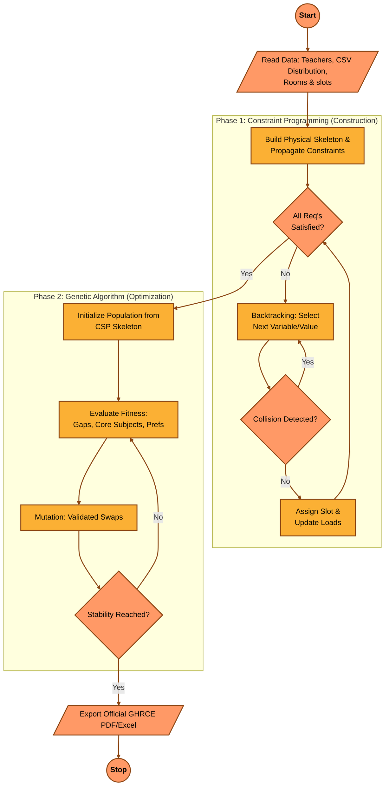

# 🎓 GHRCE AI Timetable Scheduling Flowchart

This document provides a visual representation of the core AI scheduling algorithm used in the **GHRCE AI Timetable & College Management System**. The flowchart follows the technical logic outlined in the system documentation, styled after institutional process standards.

---

## 🤖 AI Scheduling Logic

The system utilizes a **Hybrid Strategy** combining deterministic **Constraint Programming (CSP)** for construction and **Genetic Algorithms (GA)** for optimization.

### 🔍 Constraint Checklist
During the **"Constraints Satisfied?"** decision node, the system validates the following:
1.  **Teacher Collision**: Is the faculty member already booked?
2.  **Room Occupancy**: Is the room available for this slot?
3.  **Class Overlap**: Are the students already in another lecture?
4.  **Subject-per-Day**: Does this subject already appear today?
5.  **Recess Guard**: Is this a protected break period?
6.  **Weekly Load**: Does the assignment exceed the teacher's maximum hours?

---
*GHRCE AI Timetable System - Logic Visualization*
