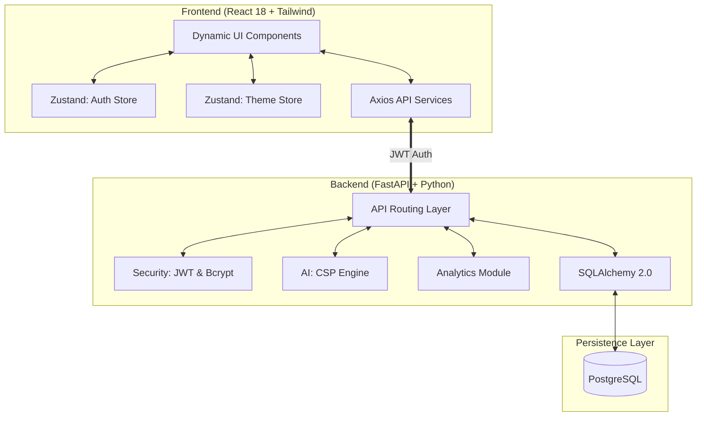

# 🎓 GHRCE AI Master Timetable & College Management System
## Exhaustive Project Documentation (v3.1.0)

This document provides a 0-to-end technical breakdown of the GHRCE AI Timetable system, detailing the architecture, security, core algorithms, and administrative workflows.

---

## 1. System Architecture 🏗️

The system employs a high-performance decoupled architecture designed for scalability and real-time interaction.

---

## 2. Security & Access Control 🔐

The system implements a robust **Role-Based Access Control (RBAC)** model.

-   **Authentication**: Stateless authentication using **JWT (JSON Web Tokens)**. Tokens are verified on every request using custom FastAPI dependencies.
-   **Password Security**: Industry-standard **Bcrypt** hashing via `passlib`.
-   **Authorization Tiers**:
    -   `require_admin`: Grants full access to resource management, AI generation, and analytics.
    -   `require_teacher`: Allows access to personal schedules, workload analytics, and leave applications.
    -   `get_current_user`: Basic access for authenticated users (e.g., viewing public schedules).

---

## 3. The AI Engine: Logic & Constraints 🤖

The core of the system is a **Hybrid AI Strategy** that combines deterministic construction with evolutionary optimization to achieve 100% feasibility and high user satisfaction.

### 3.1 Phase 1: Constraint Programming (CSP)
This phase builds a valid, conflict-free skeletal timetable using a **Backtracking Search** with the **MRV (Minimum Remaining Values)** heuristic.
1.  **Ingestion**: Gathers Teachers, Rooms, Subjects, and TimeSlots.
2.  **Forward Checking**: Prunes variable domains after each assignment to maintain global consistency.
3.  **Institutional Constraints**: Validates against primary constraints:
    -   **Teacher Collision**: Faculty identifier cannot be in the same slot twice.
    -   **Room Occupancy**: Rooms cannot be double-booked.
    -   **Class/Batch Overlap**: Students cannot have overlapping lectures.
    -   **Lab Batch Separation**: Batches B1, B2, B3 of the same subject/class must be separated.
    -   **Dynamic Relaxation**: If a deadlock is detected at 1M iterations, the engine fallback to allow same-subject theory sessions on the same day.

### 3.2 Phase 2: Genetic Algorithm (GA)
Once a 100% valid "skeleton" is found, the **Genetic Algorithm** optimizes it for soft constraints.
-   **Fitness Function**: Scores based on Student Gaps (-10 to -60 penalty), Core Subjects in Morning (+150 reward), and Faculty Preferences.
-   **Validated Mutation**: Uses "Validated Swaps" to improve schedules without breaking any Phase 1 hard constraints.
-   **Stability**: Evolved over 30 generations to ensure peak academic fitness.

---

## 4. Advanced Administrative Features 🛠️

### 📊 Comprehensive Analytics
The `analytics` router provides real-time insights visualized on the dashboard:
-   **Teacher Workload**: Active lecture counts vs. maximum capacity.
-   **Room Utilization**: Percentage of slots used per classroom/lab.
-   **Attendance Trends**: Faculty and student presence patterns.
-   **Departmental Load**: Distribution of academic burden across departments.

### ✍️ Manual Timetable Editor
For edge cases, admins can manually override the AI:
-   **Manual Creation**: Drag-and-drop or form-based slot allocation.
-   **Conflict Validation**: Real-time checking against teacher/room availability before saving.
-   **Subject Mapping**: Automatic filtering of teachers based on subject qualifications.

### 📥 Bulk Data Ingestion
-   **CSV Uploads**: Batch processing for Teachers, Rooms, and Subjects to minimize manual entry.
-   **Seeding System**: Dedicated `seed.py` for initializing fresh environments with institution-specific data.

---

## 5. Database Schema (Selection) 💾

| Table | High-Level Purpose |
| :--- | :--- |
| `users` | Auth credentials and roles. |
| `teachers` | Faculty details, specializations, and load limits. |
| `timetable_entries` | The master schedule (Class, Teacher, Subject, Room, Slot). |
| `leave_requests` | Teacher leave tracking and admin approval workflow. |
| `attendance` | Daily presence logs for faculty. |
| `substitute_assignments` | Audit trail of AI-generated substitutions. |

---

## 6. Frontend Module Overview 💻

Developed with **React 18**, the frontend is divided into specialized modules:
-   **`AdminPortal`**: Dashboard, AI controls, Resource management, and Analytics.
-   **`TeacherPortal`**: Personal timetable, Attendance marking, and Workload visualization.
-   **State Management**:
    -   `authStore (Zustand)`: Handles JWT persistence and user session.
    -   `themeStore (Zustand)`: Manages Dark/Light mode preferences.

---

*GHRCE AI Timetable System - Empowering Academic Excellence through Automation.*
